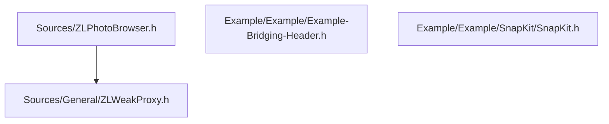

# ARCHITECTURE.md

## Overview

This document outlines the architectural structure and module dependencies of the **ZLPhotoBrowser** repository, derived directly from the project's dependency graph.

The repository is structured into two main components:
1. **Core Library (`Sources/`)**: Contains the core codebase header files and utilities.
2. **Example App (`Example/`)**: Contains implementation examples and supporting headers such as bridging headers and integrated frameworks.

---

## High-Level Architecture Diagram

The following diagram illustrates the dependency relationships between the files in the codebase.

---

## Component Breakdown

### 1. Core Library (`Sources/`)

This directory contains the primary codebase files.

* **`Sources/ZLPhotoBrowser.h`**
  * **Role**: Primary header file for the library.
  * **Entities**: `ZLPhotoBrowser.h`
  * **Dependencies**: 
    * `Sources/General/ZLWeakProxy.h`

* **`Sources/General/ZLWeakProxy.h`**
  * **Role**: General utility component providing proxy functionality to prevent strong reference cycles.
  * **Entities**: `ZLWeakProxy.h`
  * **Dependencies**: None.

---

### 2. Example Application (`Example/`)

This directory contains supporting headers and external components used in the project's example target.

* **`Example/Example/Example-Bridging-Header.h`**
  * **Role**: Swift/Objective-C bridging header for the example application target.
  * **Entities**: `Example-Bridging-Header.h`
  * **Dependencies**: None.

* **`Example/Example/SnapKit/SnapKit.h`**
  * **Role**: Embedded header for SnapKit within the example project.
  * **Entities**: `SnapKit.h`
  * **Dependencies**: None.

---

## Dependency Summary Matrix

| File Path | Internal Dependencies | Key Entities |
| :--- | :--- | :--- |
| `Sources/ZLPhotoBrowser.h` | `Sources/General/ZLWeakProxy.h` | `ZLPhotoBrowser.h` |
| `Sources/General/ZLWeakProxy.h` | *None* | `ZLWeakProxy.h` |
| `Example/Example/Example-Bridging-Header.h` | *None* | `Example-Bridging-Header.h` |
| `Example/Example/SnapKit/SnapKit.h` | *None* | `SnapKit.h` |